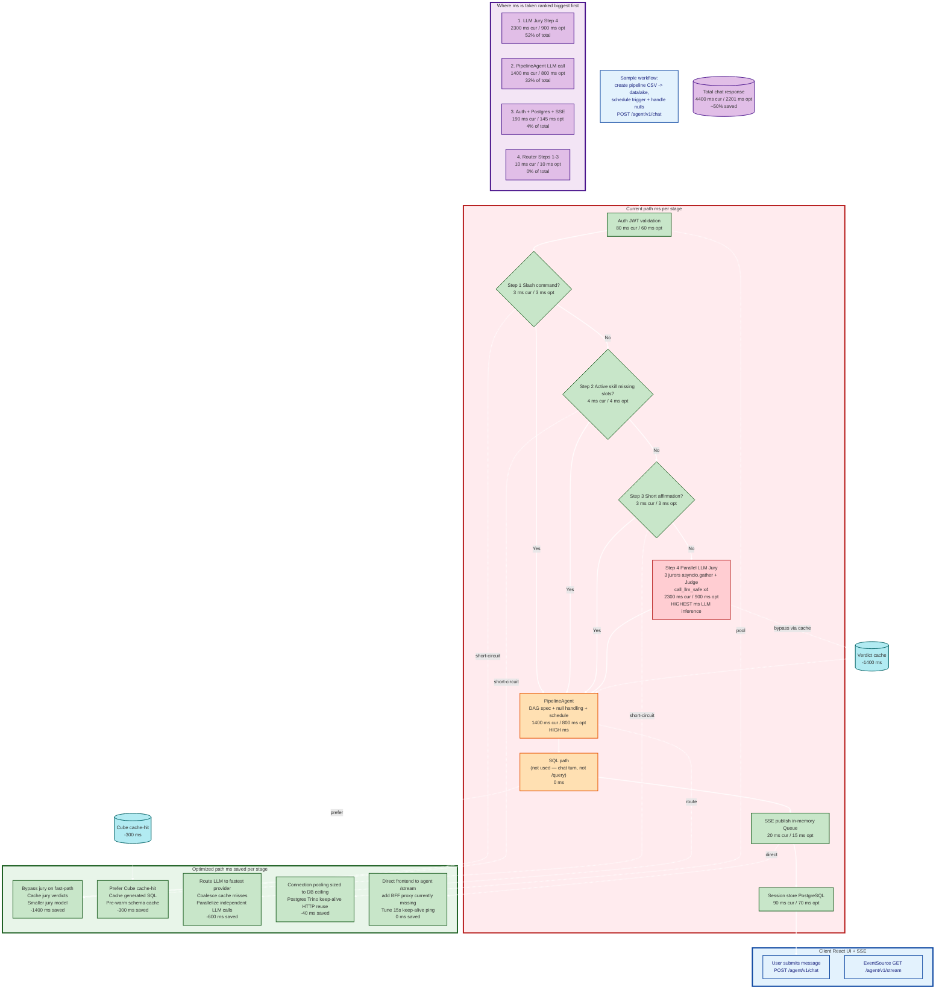

```mermaid
flowchart TD
    %% Reusable colour classes for readability
    classDef client fill:#e3f2fd,stroke:#0d47a1,stroke-width:2px,color:#1a237e
    classDef hot fill:#ffcdd2,stroke:#b71c1c,stroke-width:2px,color:#333
    classDef warm fill:#ffe0b2,stroke:#e65100,stroke-width:2px,color:#333
    classDef cool fill:#c8e6c9,stroke:#1b5e20,stroke-width:2px,color:#333
    classDef cached fill:#b2ebf2,stroke:#006064,stroke-width:2px,color:#333
    classDef rank fill:#e1bee7,stroke:#4a148c,stroke-width:2px,color:#333

    %% ---------- CLIENT ----------
    subgraph CLIENT["Client React UI + SSE"]
        UI["User submits message\nPOST /agent/v1/chat"]:::client
        EV["EventSource GET /agent/v1/stream"]:::client
    end

    %% ---------- SAMPLE WORKFLOW LABEL ----------
    SAMPLE["Sample workflow:\ncreate pipeline CSV -> datalake,\nschedule trigger + handle nulls\nPOST /agent/v1/chat"]:::client

    %% ---------- CURRENT PATH (hot / red) ----------
    subgraph CURRENT["Current path ms per stage"]
        AUTH["Auth JWT validation\n80 ms cur / 60 ms opt"]:::cool
        RT1{"Step 1 Slash command?\n3 ms cur / 3 ms opt"}:::cool
        RT2{"Step 2 Active skill missing slots?\n4 ms cur / 4 ms opt"}:::cool
        RT3{"Step 3 Short affirmation?\n3 ms cur / 3 ms opt"}:::cool
        JURY["Step 4 Parallel LLM Jury\n3 jurors asyncio.gather + Judge\ncall_llm_safe x4\n2300 ms cur / 900 ms opt\nHIGHEST ms LLM inference"]:::hot
        AGENT["PipelineAgent\nDAG spec + null handling + schedule\n1400 ms cur / 800 ms opt\nHIGH ms"]:::warm
        SQL["SQL path\n(not used — chat turn, not /query)\n0 ms"]:::warm
        PUB["SSE publish in-memory Queue\n20 ms cur / 15 ms opt"]:::cool
        PG["Session store PostgreSQL\n90 ms cur / 70 ms opt"]:::cool
    end

    %% ---------- OPTIMIZED PATH (cool / green) ----------
    subgraph OPT["Optimized path ms saved per stage"]
        OJ["Bypass jury on fast-path\nCache jury verdicts\nSmaller jury model\n-1400 ms saved"]:::cool
        OS["Prefer Cube cache-hit\nCache generated SQL\nPre-warm schema cache\n-300 ms saved"]:::cool
        OL["Route LLM to fastest provider\nCoalesce cache misses\nParallelize independent LLM calls\n-600 ms saved"]:::cool
        OP["Connection pooling sized to DB ceiling\nPostgres Trino keep-alive HTTP reuse\n-40 ms saved"]:::cool
        OE["Direct frontend to agent /stream\nadd BFF proxy currently missing\nTune 15s keep-alive ping\n0 ms saved"]:::cool
    end

    %% ---------- CURRENT EDGES ----------
    SAMPLE --> AUTH
    AUTH --> RT1
    RT1 -->|Yes| AGENT
    RT1 -->|No| RT2
    RT2 -->|Yes| AGENT
    RT2 -->|No| RT3
    RT3 -->|Yes| AGENT
    RT3 -->|No| JURY
    JURY --> AGENT
    AGENT --> SQL
    SQL --> PUB
    PUB --> PG
    PG --> UI

    %% ---------- OPTIMIZATION EDGES (dashed = saves ms) ----------
    RT1 -.->|short-circuit| OJ
    RT2 -.->|short-circuit| OJ
    RT3 -.->|short-circuit| OJ
    JURY -.->|bypass via cache| VC[("Verdict cache\n-1400 ms")]:::cached -.-> AGENT
    SQL -.->|prefer| CC[("Cube cache-hit\n-300 ms")]:::cached -.-> OS
    AGENT -.->|route| OL
    AUTH -.->|pool| OP
    PUB -.->|direct| OE

    %% ---------- TOTALS ----------
    TOT[("Total chat response\n4400 ms cur / 2201 ms opt\n~50% saved")]:::rank

    %% ---------- LATENCY RANKING (purple) ----------
    subgraph RANK["Where ms is taken ranked biggest first"]
        R1["1. LLM Jury Step 4\n2300 ms cur / 900 ms opt\n52% of total"]:::rank
        R2["2. PipelineAgent LLM call\n1400 ms cur / 800 ms opt\n32% of total"]:::rank
        R3["3. Auth + Postgres + SSE\n190 ms cur / 145 ms opt\n4% of total"]:::rank
        R4["4. Router Steps 1-3\n10 ms cur / 10 ms opt\n0% of total"]:::rank
    end

    %% Section border emphasis
    style CURRENT fill:#ffebee,stroke:#b71c1c,stroke-width:4px
    style OPT fill:#e8f5e9,stroke:#1b5e20,stroke-width:4px
    style CLIENT fill:#e3f2fd,stroke:#0d47a1,stroke-width:4px
    style RANK fill:#f3e5f5,stroke:#4a148c,stroke-width:4px

    %% Make all links thicker and brighter so solid + dashed lines are visible on dark backgrounds
    linkStyle default stroke-width:3px,fill:none,stroke:#ffffffcc
```
